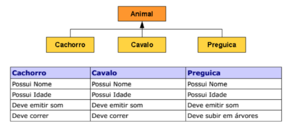

##Ex 7 - Implemente as classes Animal , Cachorro , Cavalo e Preguiça
Crie uma hierarquia de classes conforme abaixo com os seguintes atributos e
comportamentos (observe a tabela), utilize os seus conhecimentos e distribua as características de forma que tudo o que for comum a todos os animais fique na classe
Animal:


## Solução:

Criei a classe Animal como abstrata e as classes Cachorro, Cavalo e Preguiça herdam (extendem) da classe Animal.
Na classe Animal adicionei os atributos nome, idade e o método emitirSom, enquanto na classe Cachorro criei o metodo correr, assim como na classe Cavalo. Na classe Preguia, criei o metodo subir em arvores.
O Código se encontra no meu [GitHub](https://github.com/royergc), no repositório [M1S07 - Ex7](https://github.com/royergc/M1S07/tree/main/src/Ex7)
Ficou assim:

Classe *Animal.java*
```
package Ex7;

public abstract class Animal {

    private String nome;
    private int idade;

    public Animal(String nome, int idade) {
        this.nome = nome;
        this.idade = idade;
    }

    public void emitirSom() {
        System.out.println(getClass().getName() + "emitindo som");
    }

    public String getNome() {
        return nome;
    }

    public void setNome(String nome) {
        this.nome = nome;
    }

    public int getIdade() {
        return idade;
    }

    public void setIdade(int idade) {
        this.idade = idade;
    }
}
```

Classe *Cachorro.java* 
```
package Ex7;

public class Cachorro extends Animal {

    public Cachorro(String nome, int idade) {
        super(nome, idade);
    }

    public void correr() {
        System.out.println("Cachorro correndo");
    }
}
```

Classe *Cavalo.java*
```
package Ex7;

public class Cavalo extends Animal {

    public Cavalo(String nome, int idade) {
        super(nome, idade);
    }

    public void correr() {
        System.out.println("Cavalo correndo");
    }
}
```

Classe *Preguica.java*
```
package Ex7;

public class Preguica extends Animal {

    public Preguica(String nome, int idade) {
        super(nome, idade);
    }

    public void subirEmArvore() {
        System.out.println("Preguiça subindo em arvore");
    }
}
```